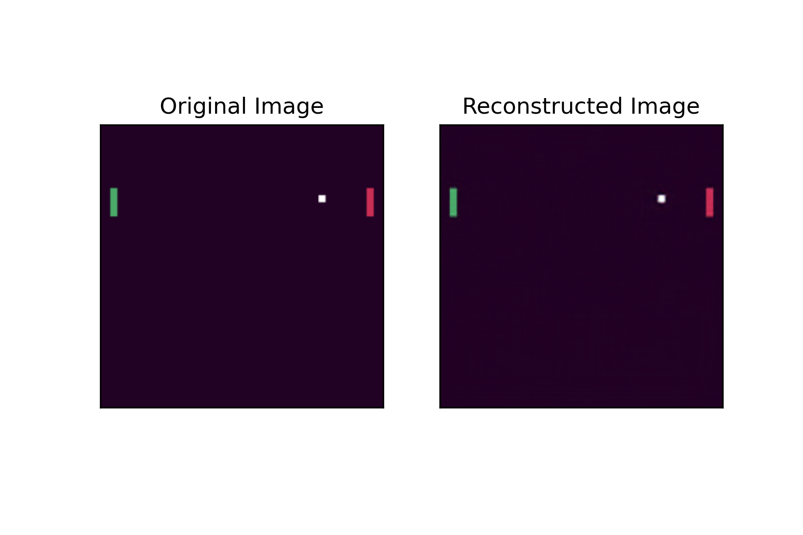
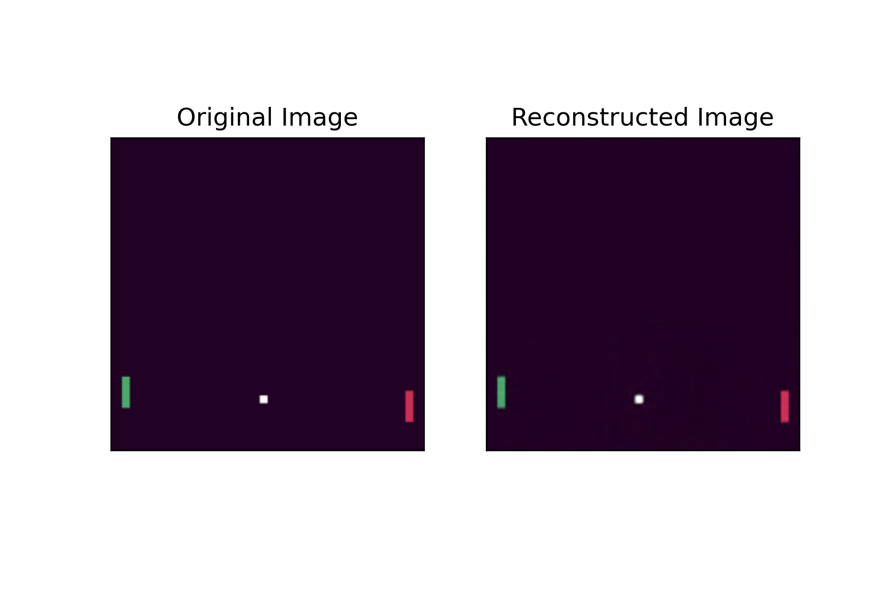
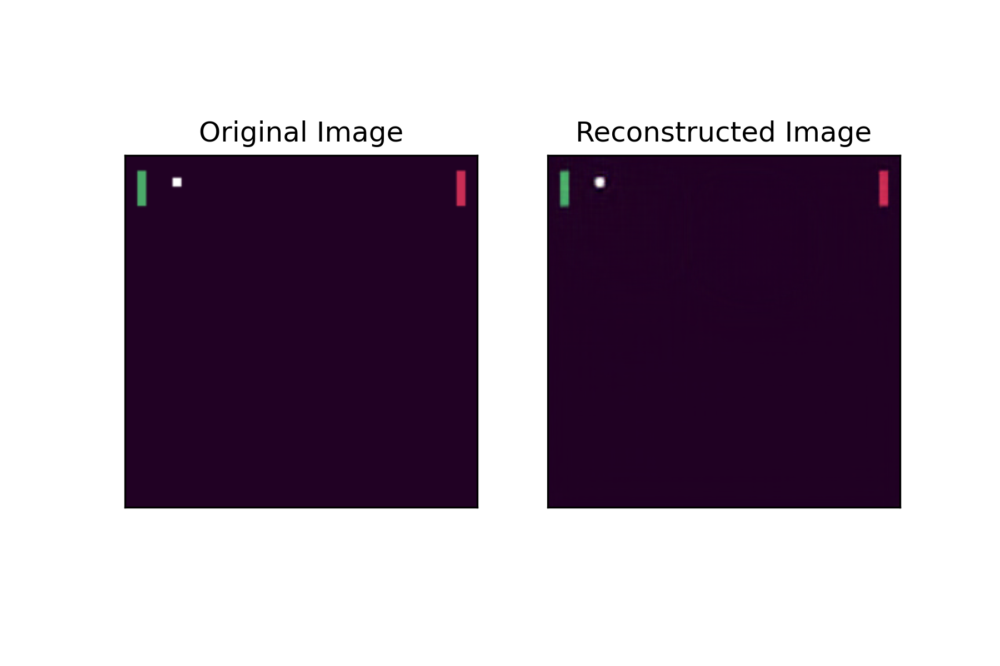
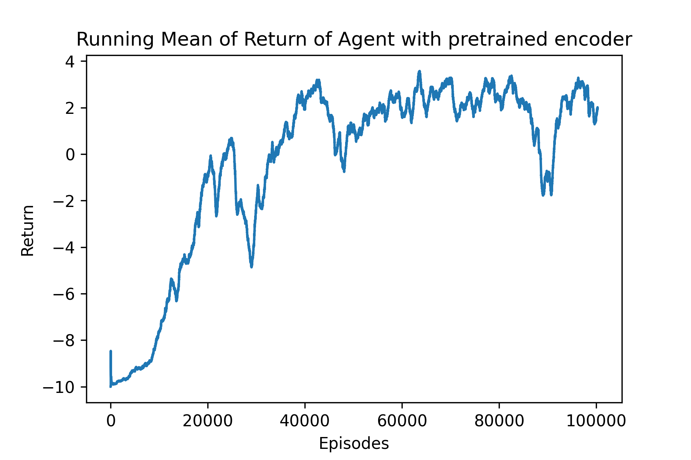
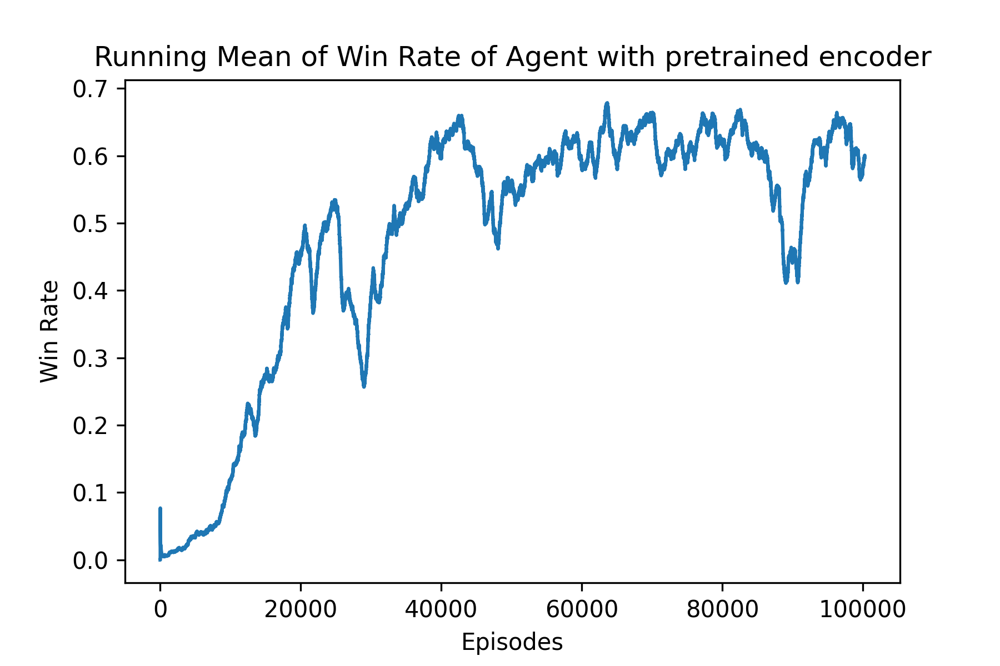
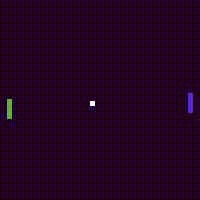

# Two Player Wimblepong

This project is part of the final project of Reinforcement Learning course at Aalto University, implementing A2C with pretrained CNN-VAE encoder on a two player version of the pong-v0 OpenAI Gym environment.

## Usage

The code includes the implementation of following approaches:

* CNN VAE: run ``scripts/train_vae.py``. Please make sure that you have run the following command ``scripts/collect_data.py`` and collected enough observations from the environment before training the VAE. 
* Simple Agent: run ``train_agent.py --headless``
* Visual Agent: run ``train_visual_agent.py --headless --pretrain PATH_TO_VAE_CHECKPOINT``

# Pretrained CNN-VAE
A CNN-VAE is pre-trained on collected observations of the wimblepong environment in order to accelerate the converge of the agent training. Some of the results on the test set are shown below.

# A2C Agent
The encoder of the Agent is loaded from the checkpoint of the encoder of the pre-trained CNN-VAE. Then the agent is trained by A2C algorithm with entropy loss to encourage exploration. With pre-trained VAE loaded as the encoder, the convergence of the agent is accelerated as the following figures show (green paddel is the agent).

